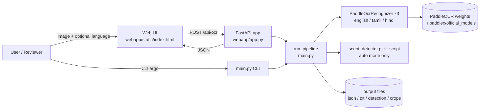
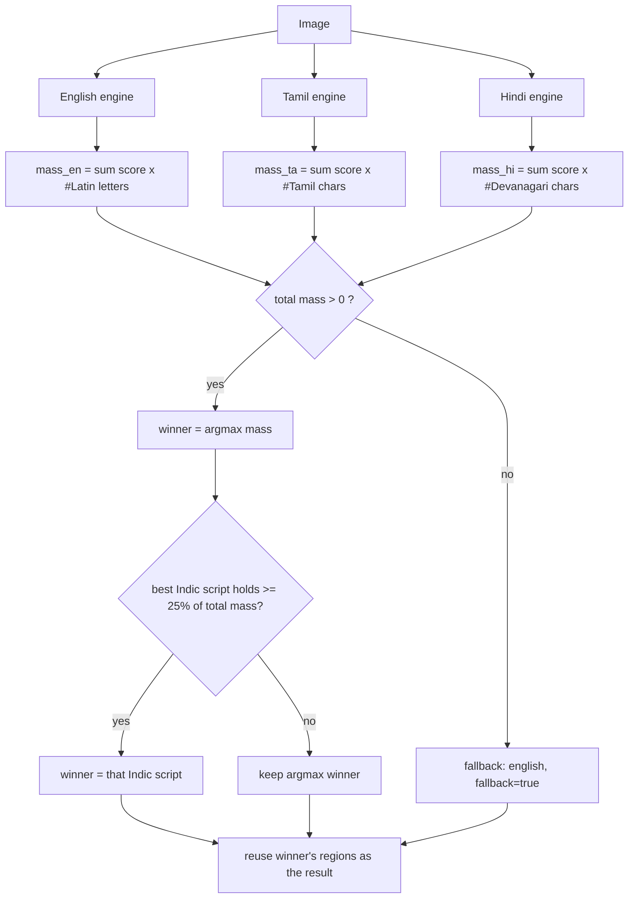
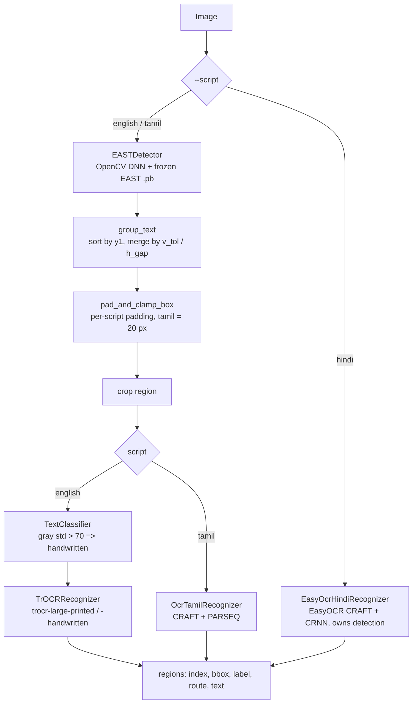

# Multilingual OCR — English, Tamil, Hindi, with automatic script detection

An OCR system that reads English, Tamil and Hindi (Devanagari) text from images and,
by default, **detects the script automatically** from the image. It is built on
PaddleOCR, ships with a CLI and a FastAPI web demo, and comes with an unusually
honest evaluation: accuracy is measured on **real third-party handwriting datasets**,
and the project's earlier architecture (V1) is preserved so the move to the current
one (V2) is reproducible.

> **How to read this document.** This README is deliberately complete and
> self-contained: `docs/` and `experiments/` are gitignored (local only), so every key
> fact, number, diagram and caveat needed to write a full technical report is repeated
> here. Section 17 is a chapter-by-chapter guide for writing a 30-40 page report from
> this file alone. Everything stated here is implemented or measured; anything not
> done is listed explicitly under Limitations and Future Work.

---

## Table of contents

1. [At a glance](#1-at-a-glance)
2. [Problem, motivation, objectives, scope](#2-problem-motivation-objectives-scope)
3. [Contributions and how strong each claim is](#3-contributions-and-how-strong-each-claim-is)
4. [System architecture (V2, production)](#4-system-architecture-v2-production)
5. [Detailed design](#5-detailed-design)
6. [Automatic script identification](#6-automatic-script-identification)
7. [The previous architecture (V1, `legacy_v1/`)](#7-the-previous-architecture-v1-legacy_v1)
8. [Implementation reference](#8-implementation-reference)
9. [Evaluation methodology](#9-evaluation-methodology)
10. [Results](#10-results)
11. [Analysis and discussion](#11-analysis-and-discussion)
12. [Testing](#12-testing)
13. [Installation and usage](#13-installation-and-usage)
14. [Related work and prior-art findings](#14-related-work-and-prior-art-findings)
15. [Limitations and threats to validity](#15-limitations-and-threats-to-validity)
16. [Project history and future work](#16-project-history-and-future-work)
17. [Guide for writing the technical report](#17-guide-for-writing-the-technical-report)
18. [Repository map, documentation index, glossary, acknowledgements](#18-repository-map-documentation-index-glossary-acknowledgements)

---

## 1. At a glance

| Item | Value |
|---|---|
| Languages / scripts | English (Latin), Tamil, Hindi (Devanagari) |
| Recognition engine | PaddleOCR (`paddleocr==3.7.0`, `paddlepaddle==3.3.1`): English -> PP-OCRv6 medium det+rec; Tamil -> PP-OCRv5 server det + `ta_PP-OCRv5_mobile_rec`; Hindi -> PP-OCRv5 server det + `devanagari_PP-OCRv5_mobile_rec` |
| Language selection | **Automatic by default** (`auto`), manual override `english` / `tamil` / `hindi` |
| Interfaces | CLI (`main.py`), HTTP API + web UI (`webapp/`) |
| Web UI | Single-file, dependency-free, light/dark, responsive: drag-drop/paste/"Try sample" upload, Auto-detect default, **Simple** view (text, Copy/Download/Share, low-confidence marking, "Read as <language>" re-run) and **Developer** view (boxes drawn on the image, evidence bars, regions table, raw JSON), Research tab |
| Outputs | `ocr_results.json`, `ocr_results.txt`, `ocr_detection.json`, `cropped/*.png` |
| Runtime | CPU-only, single process; all three models warm-loaded at web-server start |
| Measured real-data accuracy (30 images each) | English 24.1% CER (sentence lines), Hindi 47.7% (words), Tamil 71.1% (words) — **not comparable across languages** |
| Script identification accuracy (150 real images) | 77.3% overall: English 96%, Hindi 86%, Tamil 50% (first argmax rule: 65.3%); see [Section 10.5](#105-automatic-script-identification-accuracy) |
| Tests | 41 passing (20 production + 21 legacy), no models/network needed |
| Language / platform | Python 3.11.4, Windows 11 (developed and measured on AMD Ryzen 5 5625U, 15.3 GB RAM, no GPU) |
| Codebase size | ~150 lines `main.py`, ~100 `paddle_recognizer.py`, ~50 `script_detector.py`, ~200 `webapp/app.py`, ~814 `webapp/static/index.html` |
| Previous architecture | `legacy_v1/` (EAST + grouping + classifier + TrOCR / ocr_tamil / EasyOCR), preserved, runnable, tested |
| Author | Ripun, IT Engineering, VIT Vellore |

---

## 2. Problem, motivation, objectives, scope

### 2.1 Problem

Most OCR tools require the user to say which language the document is in, and
open-source OCR for Indic scripts (Tamil, Devanagari) is far less mature and less
evaluated than for English. A usable multilingual tool should (a) read the supported
scripts, (b) not demand a language choice, and (c) be honest about how accurate it
really is on real handwriting, which is much harder than clean printed text.

### 2.2 Project origin

The project began (March 2026) as an English prototype — EAST text detector, a
geometric word-grouping step, a printed/handwritten heuristic and TrOCR — that
worked on one sample image. It was then audited, repaired, extended to Tamil and
Hindi, evaluated, and finally re-architected.

### 2.3 Objectives

1. Fix correctness bugs found in the prototype and protect them with tests.
2. Support three languages through a clean, extensible architecture.
3. Measure accuracy on **real** data with a clearly defined metric.
4. Remove the need for the user to choose a language (automatic script detection).
5. Provide a presentable web demo and complete documentation.
6. Extract any honest, defensible research findings (journal-oriented), while
   explicitly not overclaiming novelty.

### 2.4 Non-goals / scope limits

Not a state-of-the-art recognizer (it wraps an existing engine); not a patentable
invention (investigated and dropped); not a deployed service (demo-grade web app); not
page-layout analysis, tables, or mixed-script per-region reading; not GPU-optimized.

---

## 3. Contributions and how strong each claim is

The contributions are **engineering and evaluation findings**, not a new algorithm.

| # | Contribution | Evidence | Strength |
|---|---|---|---|
| C1 | A grouping bug in the prototype silently clipped OCR input; fixing it recovered clipped text | 19 of 32 recognized lines gained text (none lost); regression tests fail before the fix and pass after | Solid for that pipeline/image; qualitative (no ground truth for the page) |
| C2 | In V1 the EAST detector failed differently per script: grouping bug (English), under-sized boxes (Tamil), zero boxes (Hindi) | English: C1; Tamil: 5 synthetic images; Hindi: 1 synthetic image at 2 thresholds | Suggestive; small and synthetic |
| C3 | Symmetric box padding is a cheap partial mitigation for the Tamil under-sizing (CER 46.3% -> 25.9% at 20 px; worse at 30 px) | 5 synthetic images | Suggestive (n=5) |
| C4 | Replacing three per-language backends with one PaddleOCR engine per language removed the detection failures and simplified the system | 16 coherent regions vs 32 fragments on the sample page; simpler code and one API | Solid as engineering; not a controlled accuracy comparison |
| C5 | On real handwriting the engines still err a lot: English 24.1%, Hindi 47.7%, Tamil 71.1% CER | 30 real images each | Real signal, small n; cross-language comparison invalid (different units) |
| C6 | A clean synthetic pilot made accuracy look far better than on real data (Hindi 7.1% vs 47.7%; Tamil 25.9% vs 71.1%) | V1 pilots vs V2 real-data runs | Supports an evaluation-practice caution only; engine and data both changed |
| C7 | "Script leakage": the Tamil engine outputs Latin letters on 17/30 real images (CER 0.91 on those vs 0.46 on the rest); Hindi 2/30 | per-sample analysis of C5 outputs | Solid for this sample; mechanism not isolated |
| C8 | Automatic script identification from recognizer outputs (argmax + Indic override), evaluated on 150 real images | 77.3% overall (English 96%, Hindi 86%, Tamil 50%); the Tamil misses are recognizer failures (no Tamil characters emitted) | Real signal, small n; works for English/Hindi, unreliable for handwritten Tamil; current rule's held-out figure not clean |

**Explicitly not claimed:** a new algorithm; that V2 is more accurate than V1 on the
same data (V1 was never run on the real datasets); that script difficulty orders as
English < Hindi < Tamil (the English test set uses long lines, the others isolated
words); that results generalize beyond the small samples; novelty of script
identification (an established problem).

---

## 4. System architecture (V2, production)

### 4.1 Context diagram



Plain text: User -> Web UI -> `POST /api/ocr` -> FastAPI -> `run_pipeline()` (also
reachable from the CLI) -> one or three `PaddleOcrRecognizer` engines (+
`pick_script` in auto mode) -> output files and JSON -> back to the UI. One process,
no database, queue, auth or external service at runtime (the only network use is the
one-time model weight download).

### 4.2 Components

| Layer | File | Responsibility |
|---|---|---|
| Entry points | `main.py` (CLI), `webapp/app.py` (HTTP) | parse input, call `run_pipeline`, return results |
| Orchestration | `main.py`: `recognize()`, `run_pipeline()` | manual vs auto mode, crops, output files |
| Recognition | `recognition/paddle_recognizer.py` | one `PaddleOcrRecognizer(script)` wraps one PaddleOCR detection+recognition pipeline |
| Script identification | `recognition/script_detector.py` | pure functions: in-script glyph mass, argmax with an Indic override at >= 25% share |
| Registry | `recognition/registry.py` | name -> engine label map |
| Configuration | `config.py`, `config.yaml` | `script`, `paths`, `logging` with defaults merge |
| Frontend | `webapp/static/index.html` | single-file UI: upload, language chooser, simple/developer views, overlay, research tab |

### 4.3 PaddleOcrRecognizer

- One instance per script; lazy: the PaddleOCR object is created on `warm_up()` or the
  first `detect_and_recognize(image_path)` call (so constructing it in tests is free).
- Created with `use_doc_orientation_classify=False`, `use_doc_unwarping=False`,
  `use_textline_orientation=False` (avoids loading extra document-preprocessing models)
  and `enable_mkldnn=False` (workaround for a PaddlePaddle/oneDNN crash, [Section 8.4](#84-environment-and-platform-notes)).
- Returns `[{index, bbox:[x1,y1,x2,y2], text, score, route}]`, sorted into reading order by `sort_reading_order`: regions are grouped into lines (two regions share a line when their vertical centres differ by at most half the first region's box height), lines are ordered top-to-bottom, regions left-to-right within a line, and `index` is re-numbered. This fixes PaddleOCR emitting a word before its left neighbour on the same line (e.g. `सूत्र` before `क्षार`).
- Which model family each language gets is chosen **inside PaddleOCR**, verified from
  its source and model-creation logs: English -> `PP-OCRv6_medium_det/rec`; Tamil ->
  `PP-OCRv5_server_det` + `ta_PP-OCRv5_mobile_rec`; Hindi -> `PP-OCRv5_server_det` +
  `devanagari_PP-OCRv5_mobile_rec`. The `route` label on each region
  (`PaddleOCR PP-OCRv6 (en)`, `PaddleOCR PP-OCRv5 (ta)`, `PaddleOCR PP-OCRv5 (hi)`)
  comes from `ENGINE_LABELS` and must be re-verified if the `paddleocr` pin changes.

### 4.4 Process-lifetime cache and warm-up

`main.py` keeps `_RECOGNIZER_CACHE {script -> PaddleOcrRecognizer}`. `warm_up()` loads
all three. The FastAPI `lifespan` hook calls it at startup so the first request is not
slow; `/api/health` reports `warm: {english, tamil, hindi, done}`.

---

## 5. Detailed design

### 5.1 Request workflow

```mermaid
sequenceDiagram
    participant B as Browser
    participant F as FastAPI (app.py)
    participant M as main.run_pipeline
    participant E as PaddleOcrRecognizer(s)
    participant D as script_detector

    Note over F,E: startup: lifespan -> warm_up() loads english, tamil, hindi
    B->>F: POST /api/ocr (file, script = auto|english|tamil|hindi)
    F->>F: validate script; save upload as webapp/uploads/{run_id}/input.<ext>
    F->>M: run_pipeline(path, run_dir, config)
    alt script == auto
        M->>E: detect_and_recognize(path)  english
        M->>E: detect_and_recognize(path)  tamil
        M->>E: detect_and_recognize(path)  hindi
        M->>D: pick_script({english, tamil, hindi})
        D-->>M: (winner | None, masses, share)
        M->>M: winner's regions are the result (fallback: english, flagged)
    else manual
        M->>E: detect_and_recognize(path)  chosen script
    end
    M->>M: crop each bbox -> cropped/{index}.png; write json/txt files
    M-->>F: {results, detection}
    F-->>B: JSON {run_id, requested_script, script, detection, results[], elapsed_seconds, was_warm}
    B->>F: GET /api/crop/{run_id}/{index}.png  (thumbnails in dev mode)
```

In words: the browser uploads an image and a script choice; the server stores it under
a random 12-hex id; `run_pipeline` runs one engine (manual) or all three (auto);
in auto mode the winning script's regions are reused as the result (no second
recognition pass); crops and files are written; JSON is returned.

### 5.2 Data model

Region (`ocr_results.json` is a list of these; `crop_url` is added only by the web API):

| Field | Type | Meaning |
|---|---|---|
| `index` | int | position in reading order: regions are sorted into lines top-to-bottom, then left-to-right within a line (`sort_reading_order`), and `index` is re-numbered after sorting |
| `bbox` | `[x1,y1,x2,y2]` ints | axis-aligned box in original image pixels |
| `text` | string | recognized text of the region |
| `score` | float 0-1 | PaddleOCR recognition confidence (4 decimals) |
| `route` | string | engine label that produced it |
| `script` | string | script the region was read as (`english`/`tamil`/`hindi`) |
| `crop_url` | string | (API only) `/api/crop/{run_id}/{index}.png` |

Detection info (`ocr_detection.json`, and `detection` in the API response):

| Field | Meaning |
|---|---|
| `mode` | `auto` or `manual` |
| `script` | script finally used |
| `fallback` | `true` if auto found no in-script text anywhere and defaulted to English |
| `share` | winner's fraction of total glyph mass (auto only; `null` in manual) |
| `masses` | per-script confidence-weighted glyph mass (auto only; `null` in manual) |

### 5.3 HTTP API

| Method & path | Purpose |
|---|---|
| `GET /api/health` | `{"status":"ok","warm":{english,tamil,hindi,done}}` |
| `GET /api/research` | static research-findings JSON used by the Research tab |
| `GET /api/sample` | the fixed sample page (`input/images/sample.png`), used by the UI's "Try sample" button |
| `POST /api/ocr` | multipart: `file` (image), `script` (`auto` default / `english` / `tamil` / `hindi`) |
| `GET /api/crop/{run_id}/{n}.png` | cropped region image; `run_id` must match `[a-f0-9]{12}` and filename `\d+\.png`, else HTTP 400 |
| `GET /` | static frontend |

Errors: unsupported `script` -> 400; unreadable image -> 400 (message from
`FileNotFoundError`); other pipeline exception -> 500 `"Pipeline error: ..."`.
Security details: the client filename is never used in a path (only a whitelisted
extension is kept); crop URLs are regex-validated (a traversal attempt returned 404);
CORS is `*`; there is **no** authentication, rate limiting or upload size limit.

### 5.4 Configuration and CLI

`config.yaml` (merged over built-in defaults by `config.py`):

```yaml
script: auto            # auto | english | tamil | hindi
paths:
  input: input/images/sample.png
  output_dir: output
logging:
  level: INFO
```

CLI flags override config: `--config`, `--input`, `--output-dir`, `--script`
(`auto|english|tamil|hindi`). In `auto` the CLI logs the detected script and its share.

### 5.5 Web UI behavior

Single file (`webapp/static/index.html`), no build step, no external fonts/scripts (works
offline), responsive down to ~390 px, light and dark themes (system default, saved in
`localStorage` when available). Screenshots: `docs/figures/` (local) — see Section 17.1.

- **Top bar:** brand, two tabs (Recognize, Research & accuracy), a server-status pill fed by
  `/api/health` polling ("Loading language models…" until all three are warm, then "Models ready",
  or "Server unreachable"), theme toggle.
- **Step 1 — Image:** drag-and-drop, click to browse, paste (Ctrl+V) or **Try sample** (loads
  `/api/sample`); PNG/JPG/BMP up to 15 MB, validated client-side; preview with size and
  dimensions and a Remove button.
- **Step 2 — Language:** **Auto-detect** (default, "recommended") or English / Tamil / Hindi, with a
  one-line hint per choice (auto: about 3x slower and least reliable for handwritten Tamil).
  **Extract text** or Ctrl+Enter runs it.
- **States:** empty; loading (spinner, elapsed timer, Cancel via `AbortController`, text that
  explains why auto-detect takes longer); error (distinguishes "server unreachable" from
  server-reported errors, with Try again); result.
- **Result header:** chip with the detected script (auto), the chosen language (manual), or a
  warning when no readable text was found; **Simple / Developer** switch.
- **Simple view:** recognized text with regions on one line joined by spaces (same rule as the
  server's `sort_reading_order`), correct font and `lang` attribute for Tamil/Devanagari; stats
  (lines, mean confidence, seconds); **Copy**, **Download .txt** (UTF-8 with BOM) and **Share**
  (Web Share API, else clipboard). Lines with a region below 60% confidence get a dotted
  underline plus a notice. After an auto run: "Not the right language? Read as ..." buttons re-run
  the same image in manual mode.
- **Developer view:** metadata (requested/used script, regions, elapsed, warm flag, run id,
  engine); for auto runs, per-script evidence bars with the note that this is a heuristic;
  the image with every region box drawn as an SVG overlay (green >= 0.85, amber >= 0.60, red
  below) with hover linking between boxes and table rows; a regions table with crop thumbnails
  and confidence pills; collapsible raw JSON with Copy JSON.
- **Honesty by design:** the UI does not show the winner `share` as a confidence (it is 1.0 whenever
  only one engine emits in-script characters, including when that winner is wrong, Section 10.5).
- **Research tab:** renders `/api/research`: real-handwriting CER bars (with a note that the
  datasets differ and are not comparable, and the earlier synthetic-pilot bars), the
  script-leakage table, the script-identification table, the V1 failure table, vendor
  benchmark context with model names, and the "what this does NOT claim" list.
- **Robustness/accessibility:** keyboard-operable dropzone and radio group, visible focus rings,
  `aria-live` results, `prefers-reduced-motion` respected; all dynamic text is inserted via
  `textContent` (no HTML injection from OCR output).

---

## 6. Automatic script identification

### 6.1 Idea

A recognizer shown text in a script it was not built for mostly emits low-confidence
garbage or characters from another script. So every engine reads the image, and the
engine whose output contains the most **confident text inside its own Unicode block**
wins. No extra model is trained or downloaded; the signal comes from the recognizers
themselves.

| Script | Characters counted |
|---|---|
| Tamil | U+0B80 - U+0BFF |
| Hindi | Devanagari U+0900 - U+097F |
| English | ASCII letters `A-Z`, `a-z` |

Digits, spaces and punctuation are ignored (script-neutral).

### 6.2 Algorithm

```
for each script s with recognized regions (text_i, score_i):
    mass(s) = sum_i  score_i * |{ c in text_i : c in block(s) }|
total   = sum_s mass(s)
winner  = argmax_s mass(s)
# Indic override (added after the first version, see 6.4):
best_indic = argmax over {tamil, hindi} of mass
if mass(best_indic) / total >= 0.25:  winner = best_indic
share   = mass(winner) / total                      # how concentrated the evidence is
if total == 0:  winner = None  ->  pipeline uses "english", fallback = true
result  = winner's regions (reused; no second recognition pass)
```



Implementation: `recognition/script_detector.py` (`script_mass`, `pick_script`,
constants `INDIC_SCRIPTS = ("tamil", "hindi")` and `INDIC_MIN_SHARE = 0.25`) — pure
functions, unit-tested without any model; orchestration in `main.recognize()`.
`share` reported for the winner is `mass(winner) / total`, so with the override it can be
below 0.5 (an Indic winner chosen at 25-50% share).

### 6.3 Known properties and limits

- **Cost:** about 3x the compute of manual mode (three engines). Manual mode runs one.
- **One script per image:** mixed-script documents get a single script and one engine's
  reading. The Indic engines also read Latin words (so a Hindi page with English words
  is read in full by the Hindi engine), but the English engine garbles Indic text, so an
  English-script winner on such a page loses the Indic text. There is no per-region
  script identification.
- **Script leakage weakens the signal** (Section 10.4): on hard handwritten Tamil the Tamil
  engine often emits Latin letters, which add to the *English* engine's mass rather than
  Tamil's, so such Tamil images can be identified as English. The measured accuracy is in
  Section 10.5.
- **The Indic override has a cost:** if an Indic engine produces >= 25% of the mass from
  garbage characters on an image that is really English, the image is misrouted to the Indic
  script. How often this happens on the evaluation images is measured in Section 10.5.
- **Blank or symbol-only images:** no evidence -> English fallback, flagged.
- **Only three scripts;** other languages in the same scripts are not distinguished
  (Marathi/Nepali in Devanagari would be reported as `hindi`).
- It is **not** a novelty claim: script identification for OCR is an established problem.

### 6.4 How the rule evolved

1. **First version (argmax):** the script with the largest glyph mass wins. Unit-tested and
   evaluated as the baseline.
2. **Indic override (author's later commit `ec77275`):** auto-detect chose English on a real
   Hindi poster containing English words, because the English engine turns Devanagari into
   Latin garbage that inflates English mass while the Hindi engine reads both scripts. The
   override lets an Indic script win once it holds >= 25% of the total mass. The 25%
   threshold is a hand-chosen constant, not fitted on the evaluation data (as far as the
   record shows); two unit tests cover it (Indic wins on a mixed poster; English kept when the
   Indic share is small).
3. **Evaluation reports both rules** (Section 10.5) because the second rule was introduced
   before the evaluation ran, so its held-out figure is not a clean unseen-data estimate.

---

## 7. The previous architecture (V1, `legacy_v1/`)



Key facts: EAST decoded score/geometry maps with NMS (`min_confidence` 0.3, overlap
0.3); grouping used `v_tol = 0.5 x avg box height`, `h_gap = 1.5 x avg box height`
(after the fix, groups expand all four edges and are returned in `(y1,x1)` order);
the classifier was a grayscale-std threshold (70), never validated; Hindi needed a
second recognizer contract ("self-detecting", takes the whole image) because EAST
returned no boxes for Devanagari. V1 has its own registry copy (so importing both
generations in one process cannot clash), config, tests (21) and heavy dependencies
(`requirements-legacy.txt`: PyTorch, transformers, `ocr_tamil`, EasyOCR) plus the EAST
weights file (`models/frozen_east_text_detection.pb`, gitignored, license unconfirmed).
Run from the repo root: `python -m legacy_v1.main --script <s>`.

**Why it was replaced:** three languages needed three backends and a second contract;
it needed per-language geometric patches (grouping fix, padding); it was slow (126.8 s
for the 32-region sample); and its detector could not handle Devanagari at all. It is
kept (not deleted) so the V1-vs-V2 comparison is reproducible.

---

## 8. Implementation reference

### 8.1 Files

| Path | Role |
|---|---|
| `main.py` | CLI + orchestration (`recognize`, `run_pipeline`, `warm_up`) |
| `config.py`, `config.yaml` | configuration loader and defaults |
| `recognition/registry.py` | route/label registry |
| `recognition/paddle_recognizer.py` | PaddleOCR wrapper per language |
| `recognition/script_detector.py` | script identification scoring |
| `webapp/app.py`, `webapp/static/index.html` | web API and UI |
| `webapp/ui_tests/` | `mock_server.py` (canned API, real static UI) and `ui_test.py` (Playwright, 32 checks); not part of `pytest` |
| `docs/figures/` | UI screenshots for the report (local-only; see its README) |
| `tests/` | 20 production tests |
| `legacy_v1/` | V1 code, tests, config, README |
| `requirements*.txt` | `requirements.txt` (production), `-dev` (pytest, datasets), `-webapp` (FastAPI, uvicorn), `-legacy` (V1 stack) |
| `experiments/runs/` | evaluation scripts, data and reports (gitignored) |
| `docs/` | research and project documents (gitignored) |
| `input/images/sample.png` | sample English exam page used throughout |
| `models/frozen_east_text_detection.pb` | V1 only, gitignored |

### 8.2 Dependencies (production `requirements.txt`)

`numpy==2.3.5`, `opencv-python==4.13.0.92`, `pillow==12.1.1`, `PyYAML==6.0.2`,
`paddlepaddle==3.3.1`, `paddleocr==3.7.0` (pulls `paddlex==3.7.2`). Web:
`fastapi==0.143.0`, `uvicorn==0.54.0`, `python-multipart==0.0.32`. Dev: `pytest==9.1.1`,
`datasets==5.1.0`.

### 8.3 Output files

`ocr_results.json` (regions), `ocr_results.txt` (one region text per line),
`ocr_detection.json` (detection info), `cropped/{index}.png` (bbox crops, clamped to the image).

### 8.4 Environment and platform notes

| Topic | Detail |
|---|---|
| oneDNN crash | With defaults PaddlePaddle 3.3.1 raised `NotImplementedError: ConvertPirAttribute2RuntimeAttribute not support [pir::ArrayAttribute<pir::DoubleAttribute>]` during detection on the development CPU; `enable_mkldnn=False` avoids it (other machines may not need it and may be faster with it on) |
| Windows file lock | `pip install` fails with `[WinError 5] Access is denied: ...cv2.pyd` while the server is running (module loaded) — stop the server first |
| Console encoding | Printing Tamil/Devanagari to a cp1252 console raises `UnicodeEncodeError` in ad-hoc scripts; the pipeline writes UTF-8 and reconfigures stdout |
| First run | PaddleOCR downloads weights per model into `~/.paddlex/official_models/` |
| Long-running jobs | The 150-image script-ID run takes a long time on CPU and a run was once lost when its process was interrupted; the runner is therefore incremental and resumable (`raw_outputs.jsonl`) |

---

## 9. Evaluation methodology

Full detail: `docs/experiment_protocol.md`. Summary:

### 9.1 Metric

**Character Error Rate (CER)** = Levenshtein distance over Unicode code points divided
by ground-truth length; overall CER = sum of distances / sum of lengths. It can exceed
1.0. Code points (not grapheme clusters) are used, so a visible Tamil/Devanagari
character spanning several code points can cost several edits; no Unicode
normalization or whitespace normalization is applied. **Exact match** = string equality.
No word error rate was computed.

### 9.2 Datasets (all `REQUIRES_REVIEW`, none redistributed)

| Folder | Source | Unit | Used |
|---|---|---|---|
| `english_real/` | Hugging Face `Teklia/IAM-line`, split `test` (mirror of the IAM Handwriting Database; mirror MIT, IAM has its own research terms) | handwritten sentence **lines**, mean 60.9 chars | first 30 |
| `tamil_real/` | `c3rl/IIIT-INDIC-HW-WORDS-Tamil`, `train` (CVIT, IIIT Hyderabad; Gongidi & Jawahar; no license stated on the mirror) | handwritten **words**, mean 9.6 chars | first 30 |
| `hindi_real/` | `c3rl/IIIT-INDIC-HW-WORDS-Hindi`, `train` | handwritten **words**, mean 6.4 chars | first 30 |
| `script_id/` | same three sources | as above | first 50 each (150); items 0-29 are byte-identical to the `*_real` images ("design"), 30-49 are "held-out" |
| `tamil_pilot/`, `hindi_pilot/` | self-generated: 5 short phrases each, `PIL.ImageDraw` + Windows `Nirmala.ttc`, white background | synthetic | 5 each |
| `input/images/sample.png` | pre-existing | one English exam page | 1 |

Samples are the first rows of each dataset stream, in order — not randomly sampled.
**Comparability caveat:** English is scored on long lines, Tamil/Hindi on short words,
from different datasets, writers and capture conditions.

### 9.3 Experiments

| ID | What | Data | Output |
|---|---|---|---|
| E1 | V1 grouping bug ablation (qualitative text diff) | `sample.png` | `experiments/runs/day1_baseline/` |
| E2 | EAST on Devanagari (box count at two thresholds) | 1 synthetic image | — |
| E3 | Tamil box-padding sweep (V1) | 5 synthetic | in-process sweep + pipeline re-run `tamil_pilot/cer_report.json` |
| E4 | Hindi pilot (V1, EasyOCR) | 5 synthetic | `hindi_pilot/cer_report.json` |
| E5 | V2 real-data CER | 30 real x 3 | `{english,tamil,hindi}_real/cer_report.json` via `run_paddleocr_eval.py` |
| E6 | Script-leakage analysis | E5 outputs | derived |
| E7 | Script identification (design / held-out) | 150 real | `script_id/raw_outputs.jsonl`, `script_id_report.json` |
| E8 | Latency | sample + word images | single timed runs |
| E9 | V1 vs V2 qualitative on `sample.png` | 1 page | — |

### 9.4 Controls and gaps

Controlled: one machine, fixed models, deterministic inference, fixed dataset order,
the same CER code for all languages, and a held-out split for script identification. The
first (argmax) rule was fixed before any of the evaluation data was scored and has no fitted
parameters; the current rule adds a hand-chosen 25% Indic-override threshold that was
introduced before the evaluation ran, so both rules are reported and the current rule's
held-out figure is not a clean unseen-data estimate. Not done: random sampling, repeated
runs, confidence intervals, significance tests, grapheme-level CER, WER, comparison
with other OCR engines, V1 on the real datasets.

---

## 10. Results

### 10.1 V1 results (legacy, synthetic / single page)

**English grouping fix (E1), `sample.png`:** 19 of 32 lines changed, all gained text:

| Before | After |
|---|---|
| `SUITABLE.` | `JUSTLY WAY THEY ARE SUITABLE.` |
| `SAFETY SYSTEM` | `FACTORY SAFETY SYSTEM` |
| `8051` | `TO AN 8051` |
| `(INT1)` | `INTERRUPT 1 (INT1)` |
| `P2` | `ITO PORT P2` |
| `BUTTON` | `EMERGENCY BUTTON` |

`MICROCONTROLLE` and a cut-off parenthetical were unchanged (different cause).

**Tamil synthetic pilot (E3):** before padding all 5 outputs were truncated
(e.g. `வணக்கம்` -> `வணக்க`); CER 46.3%, 0/5 exact. In-process padding sweep (values
from the run output; not saved as a file; concatenated all regions per image):

| Padding (px) | 0 | 5 | 10 | 15 | 16 | 18 | 20 | 22 | 24 | 26 | 30 |
|---|---|---|---|---|---|---|---|---|---|---|---|
| CER | 0.500 | 0.426 | 0.352 | 0.352 | 0.315 | 0.296 | 0.296 | 0.333 | 0.315 | 0.296 | 0.370 |

Through the real pipeline (first region only) at 20 px: **CER 25.9%, 1/5 exact**
(sample 0 `வணக்கம்` exact; `கல்வி அறிவு` -> `கல்விஅறிவு`; `இது ஒரு சோதனை` -> `ததன`, CER 0.77,
still a severe failure). Absolute values differ slightly between the two procedures; the
trend (improves to ~18-26 px, worse at 30 px) is the finding. n=5, one font.

**Hindi synthetic pilot (E4):** CER 7.1%, exact 3/5 (EasyOCR). **E2:** EAST returned 0
boxes at confidence 0.3 and 0.05 on a synthetic Devanagari image (1143 non-white pixels);
EasyOCR's detector read it correctly (`नमस्ते`, 0.90).

### 10.2 V2 qualitative on the sample page (E9)

16 coherent regions (V1: 32 fragments). Examples: `Smoke sensor connected to External
Interrupt 0 (INT0)` complete (V1: cut at `0 (`); `microcontroller:` (V1: `MICROCONTROLLE`);
`Emergency push button connected to External Interrupt 1 (INT1)`; confidences mostly 0.98-1.0
(one low: a stray `1`, 0.55).

### 10.3 V2 real-data CER (E5)

| Script | Dataset | Unit | n | Mean GT chars | **CER** | Exact | Median CER | Samples CER<=0.25 | Samples CER>=1.0 | Empty predictions |
|---|---|---|---|---|---|---|---|---|---|---|
| English | IAM-line | line | 30 | 60.9 | **24.1%** | 0/30 | 0.146 | 23 | 2 | 2 |
| Hindi | IIIT-INDIC-HW-WORDS-Hindi | word | 30 | 6.4 | **47.7%** | 2/30 | 0.333 | 12 | 8 | 0 |
| Tamil | IIIT-INDIC-HW-WORDS-Tamil | word | 30 | 9.6 | **71.1%** | 1/30 | 0.909 | 4 | 12 | 0 |

Examples (ground truth -> prediction, per-sample CER):

| Script | Ground truth | Prediction | CER |
|---|---|---|---|
| English | `He is also a director of a couple of garages . And he finds time as well to be a lyric` | same text but `garages.` | 0.012 |
| English | `the switch because of the topicality of African` | `the swith because ...` | 0.021 |
| English | `She plays the possessive mother of a man whose hobby revolves` | `` (empty) | 1.0 |
| Hindi | `टाटा`, `बेचने` | exact | 0.0 |
| Hindi | `केंद्रों` -> `केंदट्रों`; `फायदेमंद` -> `फापदेमंद` | small substitutions | 0.125 |
| Hindi | `डीजल` -> `Dutnt` | Latin garbage | 1.25 |
| Tamil | `எடுக்கலாம்` | exact | 0.0 |
| Tamil | `இந்தியர்களுக்கு` -> `இந்தியர்கமுக்கு` | one glyph wrong | 0.067 |
| Tamil | `பேச்சைக்` -> `BODA`; `ஏளனம்` -> `Jaostlo` | Latin garbage | 1.0 / 1.4 |

### 10.4 Script leakage (E6)

| Engine | Non-empty predictions | With Latin letters | CER on those | CER on the rest |
|---|---|---|---|---|
| Tamil | 30 | **17** (57%) | 0.912 | 0.461 (13 predictions; 9 fully in Tamil script) |
| Hindi | 30 | 2 | 1.167 | 0.455 (28 predictions; 25 fully in Devanagari) |

Examples: Tamil `nigeggn`, `uoog்`, `BODA`, `Bnonbe`, `TளியwT`, `நரTய`, `அmi`; Hindi `tt`, `Dutnt`.
The English engine instead returned empty strings for 2/30 lines. Interpretation: the
multilingual recognizers include Latin characters in their output vocabulary and fall
back to them on hard input (inferred from outputs, not from the dictionary files).

### 10.5 Automatic script identification accuracy

Both rules were scored on the same cached engine outputs for 150 real images (50 per
language). "Design" = the first 30 images per language (examined while the first rule was built);
"held-out" = items 30-49 per language. The `argmax` rule was fixed before any of this data was
scored; the `current` rule (argmax + Indic override at >= 25% of glyph mass) was introduced before
the evaluation ran, so **its held-out figure is not a clean unseen-data estimate**.

| Rule | Design (n=90) | Held-out (n=60) | All (n=150) |
|---|---|---|---|
| `argmax` (first rule) | 62.2% (56/90) | 70.0% (42/60) | 65.3% (98/150) |
| `current` (+ Indic override) | 76.7% (69/90) | 78.3% (47/60) | **77.3% (116/150)** |

Per true script, all 150 images:

| True script | `argmax` | `current` |
|---|---|---|
| English | 48/50 (96%) | 48/50 (96%) |
| Hindi | 32/50 (64%) | 43/50 (86%) |
| Tamil | 18/50 (36%) | 25/50 (50%) |

Confusion matrix of the `current` rule (all 150; rows = true script, columns = predicted):

| True \ predicted | english | tamil | hindi | none |
|---|---|---|---|---|
| english | 48 | 0 | 0 | 2 |
| tamil | 18 | 25 | 2 | 5 |
| hindi | 6 | 0 | 43 | 1 |

Held-out only (n=60, `current`): English 20/20, Hindi 17/20 (3 -> english), Tamil 10/20 (6 -> english, 4 -> none).

What the numbers show:

- **English is reliable (96%).** The two misses are the two images on which the English engine
  itself returned an empty string (no evidence -> `none`, which the pipeline turns into a flagged
  English fallback).
- **The Indic override helped without a measured downside here:** +12 points overall (Hindi 64% -> 86%,
  Tamil 36% -> 50%), and **0 of the 50 English images were misrouted to an Indic script**.
- **Tamil is unreliable (50%) and the cause is the recognizer, not the scoring rule.** Of the 25
  misidentified Tamil images, in 21 the Tamil engine's output contained **no Tamil characters at all**
  (22 contained Latin letters, i.e. script leakage) and in 3 the Tamil share was below 25%; of the 7
  misidentified Hindi images, 5 had no Devanagari at all. When the matching engine cannot read the
  script, no rule built on the engines' outputs can recognize it.
- **`share` is not a usable confidence.** The median winner share is 1.0 because the other engines
  often emit no in-script characters, which also happens when the winner is wrong (an English winner
  on a Tamil image typically has share 1.0). The UI therefore does not present it as certainty.
- **Practical guidance:** use auto-detect for English and Hindi; when the text is known to be
  handwritten Tamil, choose Tamil manually (it is also 2-3x faster).

Latency (medians over the 150 images, which mix sentence lines and word images, CPU-only): English
engine 2.95 s, Tamil engine 5.16 s, Hindi engine 5.11 s per call, **13.27 s per image for all three**
(auto mode) vs about 3-5 s for one engine (manual mode). Two images stalled for about 36 minutes and
about 3 hours (the laptop pausing); medians are used so those two do not distort the figures.
Sample size is 50 images per language; intervals are wide (e.g. Tamil 25/50 is 50% +/- about 14 points).


### 10.6 Latency (CPU, warm models, single measurements)

| Case | Time |
|---|---|
| V2 English, 16 regions, manual | 14.5 s |
| V2 Tamil, one real word image, manual | 6.4 s |
| V2 Hindi, one real word image, manual | 2.5 s |
| V1 English, 32 regions | 126.8 s (TrOCR-large, ~4 s/region) |
| V1 Tamil / Hindi, 1-region synthetic images | ~0.4 s |
| V2 auto mode | 13.3 s per image (median over 150 images; sum of the three engines: 3.0 + 5.2 + 5.1 s) |

### 10.7 Vendor-reported accuracy (context only)

PaddleOCR's own published recognition accuracies: `en_PP-OCRv5_mobile_rec` 85.25%,
`ta_PP-OCRv5_mobile_rec` 94.2%, `devanagari_PP-OCRv5_mobile_rec` 84.96%, each on the
vendor's own test sets. The English figure belongs to a PP-OCRv5 model; this project's
English pipeline uses PP-OCRv6, so it is not the model in use. These are not comparable to
the real-handwriting results above and the large gap was not diagnosed.

---

## 11. Analysis and discussion

1. **Architecture.** Moving from a per-language patchwork to one engine per language
   removed an entire class of failures (detector incompatibility, grouping) and
   collapsed three code paths into one. The price is dependence on PaddleOCR's internal
   model selection and a heavier engine than a trivial detector.
2. **Accuracy on real handwriting is the main weakness.** Even with a strong modern
   engine, Tamil word recognition is mostly wrong (median CER 0.91) and Hindi is
   mixed (median 0.33); English sentence lines are comparatively good (median 0.15).
   Because units differ (lines vs words) and datasets differ, **these three numbers must
   not be read as a ranking of script difficulty**.
3. **Script leakage** explains part of the Tamil errors: predictions that contain Latin
   letters have twice the CER of those that do not. It also couples recognition quality
   to script identification: a Tamil image on which the Tamil engine emits Latin letters
   adds mass to the English engine.
4. **Synthetic vs real.** The V1 synthetic pilots suggested 7.1% (Hindi) and 25.9% (Tamil)
   CER; real handwriting gave 47.7% and 71.1% on V2. Since both engine and data changed,
   the safe lesson is about practice: validate on a real third-party dataset before
   quoting accuracy. (Informally, V2 also read the clean synthetic Hindi images well, which
   suggests data difficulty rather than the engine swap drives the gap; not saved as a result.)
5. **Vendor benchmarks do not transfer.** Official figures are for specific mobile
   models on the vendor's data; the project's English model is a different generation.
6. **Auto-detect trades compute for convenience** (about 3x) and is bounded by the
   recognizers' own failure modes; manual mode is the fast path when the language is
   known. See Section 10.5 for the measured accuracy.
7. **Honest framing for a paper:** a case study of script-dependent failure modes and
   their remediation, a real-data measurement with a quantified failure mode, an
   evaluation-practice caution, and a tested script-ID baseline. A stronger paper needs
   larger real datasets, word-level units for all languages, grapheme-level metrics,
   same-engine controls and comparison with other engines.

---

## 12. Testing

`pytest tests/ legacy_v1/tests/ -q` -> **41 passed**, no model downloads or network.

| File | Tests | Covers |
|---|---|---|
| `tests/test_registry.py` | 4 | register/lookup, missing route, three scripts registered, exact engine labels |
| `tests/test_paddle_recognizer.py` | 3 | lazy construction (model not loaded), invalid script -> `ValueError`, `sort_reading_order` (line grouping, left-to-right order, re-numbered `index`) |
| `tests/test_script_detector.py` | 9 | Latin/Tamil/Devanagari glyph counting, confidence weighting, argmax, out-of-block garbage ignored, no-evidence cases, Indic override on a mixed Hindi+English poster, English kept when the Indic share is small |
| `tests/test_main_recognize.py` | 4 | `main.recognize` orchestration with fake recognizers: auto picks the right script and reuses its regions, English fallback is flagged, manual runs only the chosen engine, masses/share reported |
| `legacy_v1/tests/test_grouping.py` | 8 | grouping regression/adversarial cases (the left-drift cases fail on pre-fix code) |
| `legacy_v1/tests/test_boxes.py` | 12 | `clamp_box`, `pad_and_clamp_box` |
| `legacy_v1/tests/test_east_detector.py` | 1 | missing image -> `FileNotFoundError` |

Not unit-tested: file/crop writing in `run_pipeline`, FastAPI endpoints. These were verified by live
requests (all three languages in auto and manual mode, crops, health, research and sample endpoints,
invalid script, traversal attempt).

**UI tests (outside `pytest`):** `webapp/ui_tests/ui_test.py` drives an installed Edge/Chrome through
Playwright against `webapp/ui_tests/mock_server.py` and checks 32 behaviours: status pill, sample
load, loading state, detected chip, line rendering, low-confidence marking, re-run buttons,
overlay/row hover linking, clipboard copy, download, theme switch, research tab, Tamil rendering
(`lang="ta"`), cancel, server-error and network-failure states, no horizontal overflow at 390 px
wide, no console errors. All pass. The UI was also driven against the real server with real
models (no console errors; auto-detect chips correct for the sample page and a Hindi word). Setup:
`pip install playwright` (uses the installed browser), then `python webapp/ui_tests/mock_server.py`
and `python webapp/ui_tests/ui_test.py`. Not tested: Firefox/Safari, screen readers.

---

## 13. Installation and usage

```
git clone https://github.com/ripuns/Multilingual-OCR-Detection.git
cd Multilingual-OCR-Detection
python -m venv ocr_env
ocr_env\Scripts\activate                 # Linux/macOS: source ocr_env/bin/activate
pip install -r requirements.txt          # production
pip install -r requirements-dev.txt      # pytest, datasets
pip install -r requirements-webapp.txt   # FastAPI, uvicorn
```

CLI:

```
python main.py                                        # auto-detect script on input/images/sample.png
python main.py --script tamil --input path\to\img.png # force one language (faster)
python main.py --input img.png --output-dir out
```

Web demo: `uvicorn webapp.app:app --host 127.0.0.1 --port 8000`, open
`http://127.0.0.1:8000` (models warm-load at start; `GET /api/health` shows readiness).

Reproduce the evaluation (detail in `docs/reproducibility.md`):

```
python experiments/runs/pull_datasets.py                 # real images from Hugging Face
python experiments/runs/run_paddleocr_eval.py all        # E5: CER reports
python experiments/runs/script_id/run_engines.py         # E7: 3 engines x 150 images (slow, resumable)
python experiments/runs/script_id/evaluate.py            # E7: script-ID accuracy
```

Legacy V1: `pip install -r requirements-legacy.txt`, place the EAST weights in `models/`,
`python -m legacy_v1.main --script english`.

---

## 14. Related work and prior-art findings

Gathered by web search during development and read as search-result summaries (titles,
abstracts, snippets), **not** as full papers; treat as pointers, not a literature review.

- **Modular vs end-to-end OCR.** Confidence-routed modular pipelines are described as
  standard in production; cascading error in modular pipelines is a named problem that
  recent work (e.g. Qianfan-OCR, arXiv 2603.13398) addresses by going end-to-end. Six open
  VLM-OCR models appeared in Oct 2025 (Nanonets OCR2-3B, PaddleOCR-VL-0.9B, DeepSeek-OCR-3B,
  Chandra-OCR-8B, OlmOCR-2-7B, LightOnOCR-1B); PP-OCRv6 (arXiv 2606.13108) reports small
  models rivaling billion-parameter VLMs.
- **Text-line grouping.** Heuristic and learned approaches both established (e.g. ReLaText,
  *Pattern Recognition*); patents exist on clustering/consolidating OCR boxes (US
  2020/0210743; USPTO 11909934).
- **Low-resource script OCR.** Active, less saturated: SynthOCR-Gen (arXiv 2601.16113), Nayana
  OCR (ACL 2025), GlotOCR Bench (arXiv 2604.12978), "Deciphering the Underserved" (arXiv
  2412.16119), Sinhala/Tamil zero-shot study (arXiv 2507.18264); Kashmiri reported unsupported
  by Tesseract/TrOCR/PaddleOCR.
- **Script identification.** Established for OCR (e.g. arXiv 1708.04671), hence not claimed novel.
- **Datasets.** IIIT-INDIC-HW-WORDS (Gongidi & Jawahar, ICDAR 2021; 872K words, 8 Indic
  scripts per its project page); IAM Handwriting Database (Marti & Bunke); uTHCD Tamil
  characters (arXiv 2103.07676).
- **Crowded, therefore dropped as contribution angles:** document-forgery detection
  (DocForge-Bench, AIForge-Doc), print steganography patents, exam/answer-sheet grading
  (CHECK-MAT, "When VLMs 'Fix' Students", commercial Indian multilingual graders), national
  credential infrastructure (NAD/DigiLocker).
- **Patent decision:** none pursued; rationale in `docs/patent_ip_assessment.md`.

---

## 15. Limitations and threats to validity

(Full list: `docs/limitations.md`, `docs/experiment_protocol.md` Section 5.)

1. n = 30 per language (150 for script-ID); first-rows sample; no confidence intervals.
2. English lines vs Tamil/Hindi words, different datasets: cross-language CER not comparable.
3. Code-point CER over-penalizes Indic graphemes; no WER.
4. V1 (synthetic, 5 images) vs V2 (real, 30 images) mixes engine and data changes.
5. V1 was never evaluated on the real datasets.
6. Script leakage and empty outputs inflate error and are not detected or corrected.
7. Script-ID design split overlaps the CER images; only the held-out split is unbiased.
8. Auto mode: ~3x compute, one script per image, three scripts only.
9. EAST/Devanagari failure was shown on one synthetic image/font; real Devanagari photos untested.
10. Vendor benchmarks are for different models/data; English label corrected to PP-OCRv6.
11. Demo hardening is minimal (no auth, rate limit, upload cap, cleanup); CORS `*`.
12. CPU-only, synchronous, single process; latency is single-run on one laptop.
13. Datasets and the EAST weights are `REQUIRES_REVIEW` for licensing.
14. Single author, single machine; no independent replication.

---

## 16. Project history and future work

### 16.1 Timeline (from Git history)

| Date | Milestone | Commits (examples) |
|---|---|---|
| 2026-03-26/27 | Prototype; Chinese TrOCR route removed; README | `7f11b45`, `a2d69dd`, `38299d6` |
| 2026-08-26 | Audit of the prototype; EAST missing-image handling | `42e599e`, `58b5b43` |
| 2026-08-27 | Grouping fix + tests; CLI/UTF-8 logging; pinned deps; config; registry; box clamping; JSON output | `e7ff323`, `6a1cbc8`, `57e4d62`, `aed56d7`, `4205eb2`, `02596e1`, `5b8aca8`, `7636214` |
| 2026-10-09 | Tamil route (`ocr_tamil`); Hindi route (EasyOCR, self-detecting contract); padding + warm-up | `bdcfbaa`, `a1d61d2`, `bb47ce0` |
| 2026-10-09 | V2: PaddleOCR rewrite, V1 moved to `legacy_v1/` | `e90636d` |
| 2026-10-09 | Automatic script identification (`d8f8290`); Indic-override rule + reading-order sort (`ec77275`); documentation overhaul | `d8f8290`, `ec77275` |

Decision log with rationale, dead ends and corrections: `docs/project_history.md`.

### 16.2 Corrections made during documentation (kept for transparency)

1. English engine is PP-OCRv6, not PP-OCRv5 (code, tests, docs fixed; vendor English figure is for another model).
2. The "script-difficulty ordering" was withdrawn (line-vs-word confound).
3. Latin "script leakage" was discovered and quantified.
4. "Synthetic overestimates real" restated as an evaluation-practice caution (engine and data both changed).
5. The script-ID evaluation runner was made incremental/resumable after a killed process lost an hour of work.
6. The script-identification rule changed after it was first documented (Indic override, Section 6.4); the evaluation therefore reports both rules, and the "rule frozen before evaluation" statement was narrowed to the first rule.
7. Latency reporting uses medians because two runs of the evaluation stalled for 36 minutes and ~3 hours (the laptop pausing), which would have made a mean meaningless.

### 16.3 Future work

- Per-region script identification for mixed-script documents.
- Use recognition confidence (flag/route low-confidence regions); detect and suppress script leakage (e.g. re-run the right engine or reject Latin output from an Indic engine).
- Larger, word-level, multi-dataset evaluation for all three languages; grapheme-level CER and WER; confidence intervals; V1 on the same real data; same-engine synthetic-vs-real control.
- Isolate why vendor Tamil accuracy (94.2%) and the real-handwriting result (71.1% CER) differ.
- More scripts/languages (a `LANG_CODES` + label entry plus evaluation); the most open research direction identified is OCR for very low-resource scripts.
- Productionization: auth, upload limits, cleanup, async/batching, GPU path, caching of the per-engine results.

---

## 17. Guide for writing the technical report

Target: **30-40 pages**. Suggested chapters, page budget, and where to take the content.
Figures use the Mermaid diagrams in this README (render them, or redraw); tables can be
copied directly.

| # | Chapter | Pages | Source in this README (and docs) |
|---|---|---|---|
| 1 | Abstract and introduction | 2 | Sections 1-3; motivation Section 2 |
| 2 | Background and related work | 3-4 | Section 14; glossary Section 18.4; `docs/project_history.md` Phase 2 |
| 3 | Requirements and design decisions | 2-3 | Section 2; design-decision table `docs/architecture.md` Section 8 |
| 4 | System architecture | 5-6 | Section 4 (context diagram, components, PaddleOcrRecognizer, cache) |
| 5 | Detailed design and workflows | 5-6 | Section 5 (sequence diagram, data model, API, config, UI) |
| 6 | Automatic script identification | 3-4 | Section 6 (idea, formula, flowchart, limits) + 10.5 results |
| 7 | The legacy architecture and migration | 3 | Section 7 (V1 flowchart, why replaced) |
| 8 | Implementation | 2 | Section 8 (files, dependencies, environment issues incl. oneDNN) |
| 9 | Evaluation methodology | 3 | Section 9 (metric definition, datasets, experiments table, controls) |
| 10 | Results | 4-5 | Section 10 (V1 results, V2 qualitative, CER table, leakage, script-ID, latency) |
| 11 | Discussion, limitations, threats to validity | 3 | Sections 11 and 15 |
| 12 | Testing | 1 | Section 12 |
| 13 | Conclusion and future work | 1-2 | Sections 3, 16.3 |
| A | Appendices | 2-3 | per-sample examples; full file map; reproduction commands; API examples |

### 17.1 Figures to include (data is in this README)

1. System context diagram (4.1). 2. Component diagram (4.2 table as a block diagram).
3. Request sequence diagram (5.1). 4. Script-ID flowchart (6.2). 5. V1 pipeline flowchart (7).
6. Bar chart of V2 real-data CER by language with unit labels (10.3) and, beside it, the V1
synthetic-pilot values (7.1% Hindi, 25.9% Tamil) — caption must state units differ.
7. Line chart of Tamil CER vs padding (10.1 table). 8. Latin-leakage grouped bars (10.4).
9. Script-ID confusion matrix (10.5). 10. Latency bar chart V1 vs V2 (10.6).
11. UI screenshots — already captured in `docs/figures/` (local; see `docs/figures/README.md` for what each shows and
which are real-model vs mock-API captures): `ui_real_01_english_auto_simple.png`, `ui_real_02_english_auto_developer.png`
(boxes + evidence bars), `ui_real_03_hindi_auto_simple.png`, `ui_real_04_tamil_manual_simple.png`,
`ui_real_05_research_light.png`, plus mock-API captures of the empty/loading/error states, the dark theme and the phone
layout (`ui_01` ... `ui_11`).

### 17.2 Tables to include

Contribution/strength table (3); experiments table (9.3); datasets table (9.2); CER table
(10.3); examples (10.3); leakage (10.4); script-ID results (10.5); latency (10.6); test
inventory (12); limitations (15).

### 17.3 Things the report must NOT claim (common pitfalls)

- That the project invented an OCR algorithm or script-identification method.
- That English < Hindi < Tamil is a difficulty ordering of the scripts.
- That synthetic data "overestimates" accuracy as a clean, same-engine fact.
- That V2 beats V1 on identical data (never measured), or the vendor benchmark numbers as
  this project's accuracy (and the English one is for a different model).
- That the system is production-ready: it is a CPU-only demo with ~24-71% real-handwriting CER.
- That mixed-script documents are handled.

### 17.4 Quick facts for captions and prose

3 languages; 3 PaddleOCR engines (English PP-OCRv6, Tamil/Hindi PP-OCRv5); auto detection
by confidence-weighted in-script glyph mass; 150 real images for script-ID (30 design + 20
held-out per language); 90 real images for CER (30 per language); 41 tests; CPU-only AMD
Ryzen 5 5625U; V1 English 126.8 s vs V2 English 14.5 s on the same sample page (V1 32
fragments, V2 16 lines).

---

## 18. Repository map, documentation index, glossary, acknowledgements

### 18.1 Repository map

```
.
├── main.py                       CLI + orchestration
├── config.py / config.yaml       configuration
├── recognition/
│   ├── registry.py               label registry
│   ├── paddle_recognizer.py      PaddleOCR wrapper (3 languages)
│   ├── script_detector.py        script identification scoring
│   └── README.md
├── webapp/
│   ├── app.py                    FastAPI backend
│   ├── static/index.html         single-file UI
│   ├── ui_tests/                 mock API + Playwright UI test (not part of pytest)
│   └── README.md
├── tests/                        20 production tests (+ README.md)
├── legacy_v1/                    V1 (EAST, grouping, classifier, TrOCR/ocr_tamil/EasyOCR) + 21 tests + README.md
├── input/images/sample.png       sample English page
├── models/                       EAST weights (V1 only, gitignored)
├── docs/                         local-only research docs (see 18.2); docs/figures/ = UI screenshots
├── experiments/                  local-only evaluation data/scripts/reports (+ README.md)
└── requirements*.txt             production / dev / webapp / legacy
```

### 18.2 Documentation index (`docs/`, local-only)

| File | Content |
|---|---|
| `architecture.md` | both architectures, diagrams, API, algorithm, runtime notes, design decisions |
| `experiment_protocol.md` | metric definitions, datasets, every experiment, threats to validity |
| `research_contribution.md` | claims with strength ratings, V1/V2 results, interpretation |
| `limitations.md` | what not to claim |
| `reproducibility.md` | environment, commands, regeneration table |
| `project_history.md` | timeline, decisions, prior-art findings, corrections |
| `dataset_and_license_inventory.md` | models/data provenance and license status |
| `patent_ip_assessment.md` | why no patent |
| `changelog.md` | notable changes |
| `project_audit.md`, `implementation_plan.md`, `session_context_summary.md` | historical (superseded) |

### 18.3 Licensing and attribution

PaddleOCR / PaddlePaddle (Baidu), Apache 2.0. Datasets: `Teklia/IAM-line` (mirror of the IAM
Handwriting Database), `c3rl/IIIT-INDIC-HW-WORDS-{Tamil,Hindi}` (CVIT, IIIT Hyderabad;
Gongidi & Jawahar) — all `REQUIRES_REVIEW`, none redistributed. V1: OpenCV (EAST),
Hugging Face Transformers + Microsoft TrOCR (MIT), `ocr_tamil` (GnanaPrasath, MIT),
EasyOCR (JaidedAI, Apache 2.0). The repository itself has no LICENSE file yet.

### 18.4 Glossary

| Term | Meaning |
|---|---|
| OCR | optical character recognition |
| Script vs language | script = writing system (Latin, Tamil, Devanagari); language = Hindi, English, ... |
| Detection / recognition | finding text regions vs reading the characters in a region |
| EAST | "Efficient and Accurate Scene Text" detector (V1) |
| CRAFT, PARSEQ, CRNN | detection/recognition network families used by `ocr_tamil` / EasyOCR |
| TrOCR | transformer OCR model (V1 English) |
| PP-OCR (v5/v6) | PaddleOCR's detection+recognition model families (V2) |
| NMS | non-maximum suppression; removes overlapping duplicate boxes |
| oneDNN / MKL-DNN | CPU acceleration library used by PaddlePaddle (disabled here) |
| CER | character error rate (Levenshtein / reference length) |
| Levenshtein distance | minimum single-character insertions, deletions, substitutions |
| Code point / grapheme | Unicode unit vs user-perceived character (Indic graphemes span several code points) |
| Virama, conjunct | Indic marks that join consonants into one visual cluster |
| Shirorekha | Devanagari horizontal headline stroke |
| Script leakage | a recognizer for script X emitting Latin letters when it fails |
| Glyph mass | confidence-weighted count of in-script characters (script-ID score) |
| Share | winner's fraction of total glyph mass |
| Manual / auto mode | user-chosen language vs automatic script identification |
| Design / held-out split | images used while designing the script-ID rule vs images not examined beforehand |
| Warm-up | loading all models at startup so requests are fast |
| V1 / V2 | previous (`legacy_v1/`) / current (repo root) architecture |

### 18.5 Author

Ripun — IT Engineering, VIT Vellore.

### 18.6 Note

Academic/portfolio project. The numbers here are real and reproducible
(`experiments/runs/`) but come from small-scale evaluations on one machine; read the
limitations before relying on any of them.
